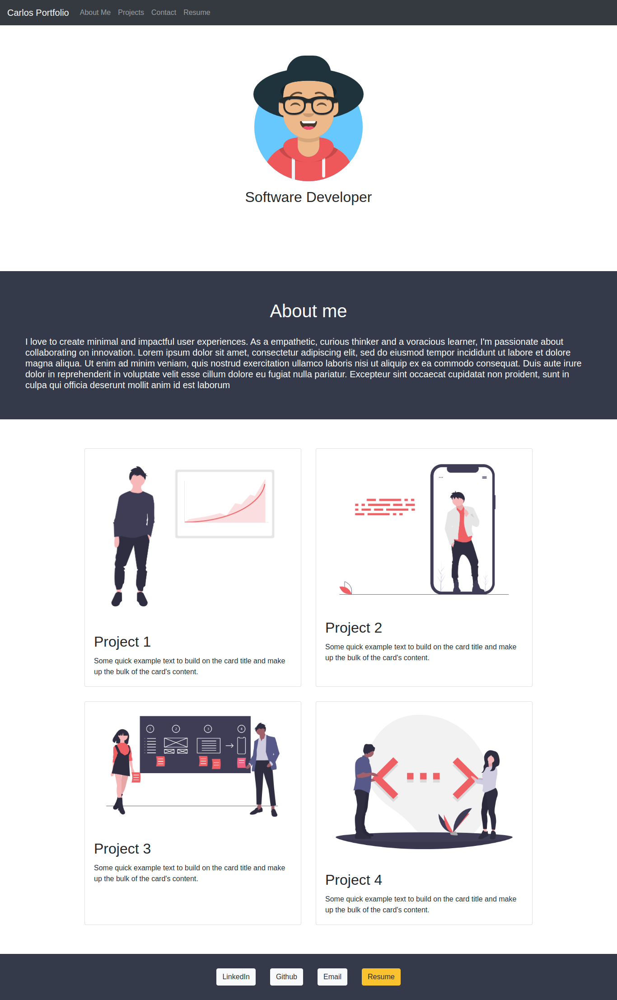

# **Webinar: Portfolio with Bootstrap | IRONHACK** 
Sample and basic portfolio using Bootstrap library. Link to the webinar -> [webinar](https://www.crowdcast.io/e/portfolio-bootstrap)

## Links
* [Webinar materials](https://gist.github.com/ManishPoduval/79ea00fc8126d9289fe82cc440f16c86)
* [Example](https://manishpoduval.github.io/responsive-bootstrap-portfolio/#)
* [Bootstrap Documentation](https://getbootstrap.com/docs/4.5/getting-started/introduction/)
* [MDN Documentation](https://developer.mozilla.org/en-US/docs/Web/HTML/Element)
* [FlexboxFroggy](https://flexboxfroggy.com/#es)
* [HappyHues](https://www.happyhues.co/)

## *Preview*
---
